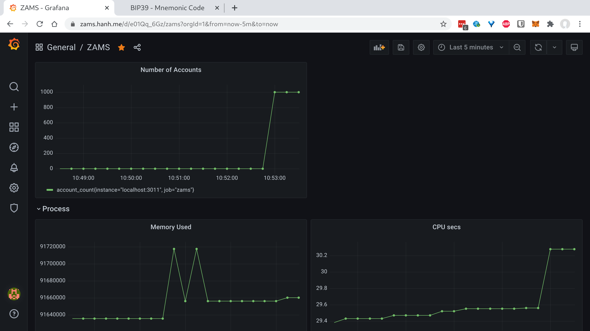
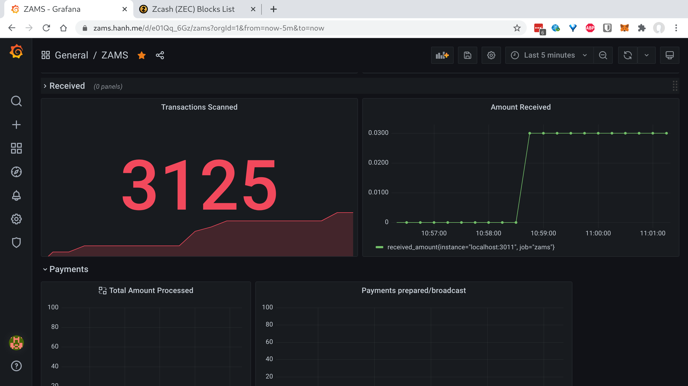
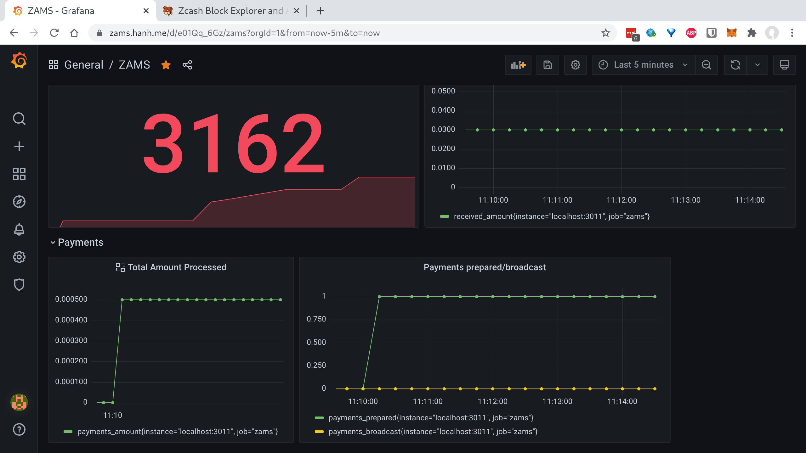
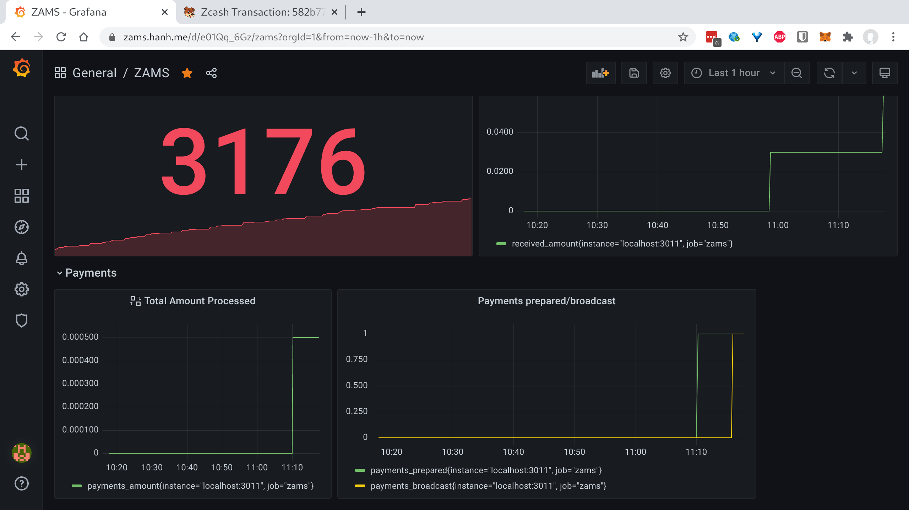
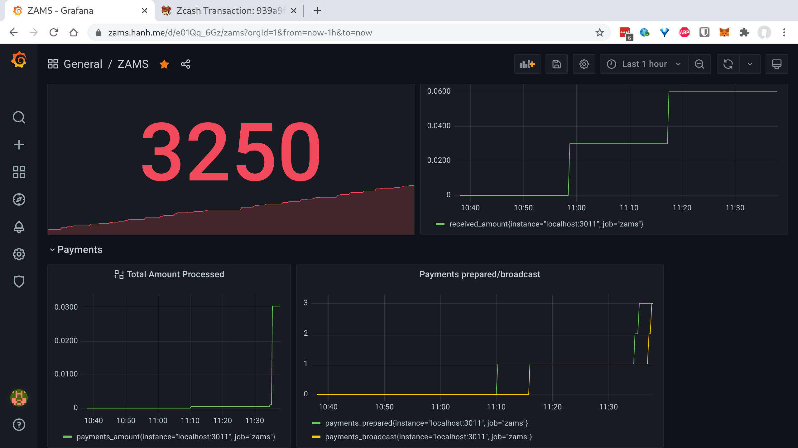

## Overview

The Coin Payments platform (CPP) is a payment system that enables
merchants to receive and send crypto currencies.

The goal of the CP integration projects (funded by the ZOMG) is
to add support for Zcash as transparent and shielded addresses.

## Architecture

Merchants typically use a vendor e-commerce platform such as Shopify
or Magento. When a customer checks out, he is redirected to the
payment processor which is taking charge of the actual payment.

CPP is a payment processor that accepts crypto currencies. In order
to handle a given type of coin, CPP delegates some functionalities
to external components.

There are two components:

- A Block Explorer / Account Manager. It should keep account balances
and inform the CPP of incoming funds. The AM is connected to the
Zcash network indirectly through a deployment of `zcashd`.
- A Signer / Account Creator. The later *must* be able to run offline.
It is responsible to generating new key pairs and for signing
outgoing transactions.

Note: This separation of responsibility is similar to a cold wallet design.
It ensures that customer funds are not spendable from a server connected
to the Internet.

## Requirements

So far, this looks like a typical application with the block explorer
being an "watch-only" wallet. However, it differs by the requirements
on the number of accounts.

> The system should support at least 500 000 accounts.

To be on the safe side, we are going to aim for 500 000 shielded and 
transparent accounts for a total of *1 million accounts*.

The speed of processing incoming transactions must keep up with
the expected block generation rate.

## Transparent Accounts

Accounts backed by a transparent address do not cause any issue. 
Since the transactions show the addresses in plaintext, it is 
matter of a database search (or hashmap lookup) to identify receiving
notes.

## Shielded Accounts

However, shielded addresses are encrypted in the output descriptions.
Therefore we have to decrypt them before we know their address.
It takes about 1 ms on a desktop machine to try a decryption key.
If we have 500 000 of them, it becomes unpractical to try them all.

Fortunately, shielded addresses have a *diversifier*. We can
generate millions of addresses from the same secret key
by varying the diversifier. The problem becomes much simplier then.

With the one and only viewing key, we try to decrypt output
descriptions. If it succeeds, we know it belongs to one of our accounts.
We extract the payment address from the plaintext note and 
proceed the same way as with transparent accounts.

The only drawback is that all these accounts *share the same
spending key*. It is not an issue when they are under the custody
of the same authority, in this case Coin Payments.

Following are some use case scenarios and their respective demos.

> The work is in progress and the implementation likely to change.

# Block Explorer API

```proto
service BlockExplorer {
  rpc GetVersion(Empty) returns (VersionReply);

  rpc ValidateAddress(ValidateAddressRequest) returns (Boolean);
  rpc GetAccountBalance(GetAccountBalanceRequest) returns (Balance);
  rpc PrepareUnsignedTx(PrepareUnsignedTxRequest)  returns (UnsignedTx);
  rpc CancelTx(PaymentId) returns (Empty);
  rpc ListPendingPayments(AccountId) returns (PaymentIds);
  rpc GetPaymentInfo(PaymentId) returns (Payment);
  rpc BroadcastSignedTx(SignedTx) returns (TxId);
  rpc EstimateFee(EstimateFeeRequest) returns (Fee);
  rpc GetCurrentHeight(Empty) returns (BlockHeight);
  rpc Sync(Empty) returns (BlockHeight);
  rpc Rewind(BlockHeight) returns (Empty);

  rpc ImportPublicKey(PubKey) returns (PubKeyId);
  rpc NewAccount(PubKeyCursor) returns (AccountCursor);

  rpc BatchNewAccounts(BatchNewAccountsRequest) returns (AccountCursor);
}
```

# Signer API

```proto
service Signer {
  rpc GetVersion(Empty) returns (VersionReply);

  rpc GenerateTransparentKey(Entropy) returns (Keys);
  rpc GenerateSaplingKey(Entropy) returns (Keys);

  rpc SignTx(SignTxRequest) returns (SignedTx);
}
```


## Creating Accounts

- Use the `GenerateSaplingKey` with some random value. Entropy is a seed phrase (or a random number) with a derivation path. It follows ZIP-32.
- The result is a full viewing key and a secret key.
The secret key must be kept safe. Our system does not store it. In
fact the Signer does not keep any state.
- Use `ImportPublicKey` with the full viewing key obtained earlier
- It returns an FVK_id.
- Finally, create one or many accounts by using either `NewAccount` or `BatchNewAccounts` passing the FVK_id as input.

In the block explorer dashboard, we can see the number of accounts.
It went up after 1000 accounts were created.



## Receiving Payments

Each account has its own address. To receive payment, just ask the payer
to send ZEC to that address. The chart "Amount Received" updates when
ZEC comes to any of our accounts.

The big number in red is the number of transactions
that have been scanned so far.



## Making Payments

In case we need to pay out (for example for a refund),
we have to prepare a payment request. The payment request
starts from the block explorer / account manager and
then gets signed by th Signer.

- First, use `PrepareUnsignedTx`

The chart "Payment prepared/broadcast" tracks payments.
We have one payment prepared but not broadcast yet.




- `SignTx`,
- and `BroadcastSignedTx`

The number of payments broadcasted catches up with the
numer of payments prepared.



Let's do a couple of these to try out sending between 
addresses.



## Getting Account Balance

- Use `GetAccountBalance` passing the account number and
the minimal number of confirmations needed.

> Transparent Addresses work exactly the same way from 
the API perspective. 

The API uses account numbers
and not actual addresses.

## Wrapping it up for Coin Payments

The next step is to provide a C# library that encapsulates
the GRPC API.
